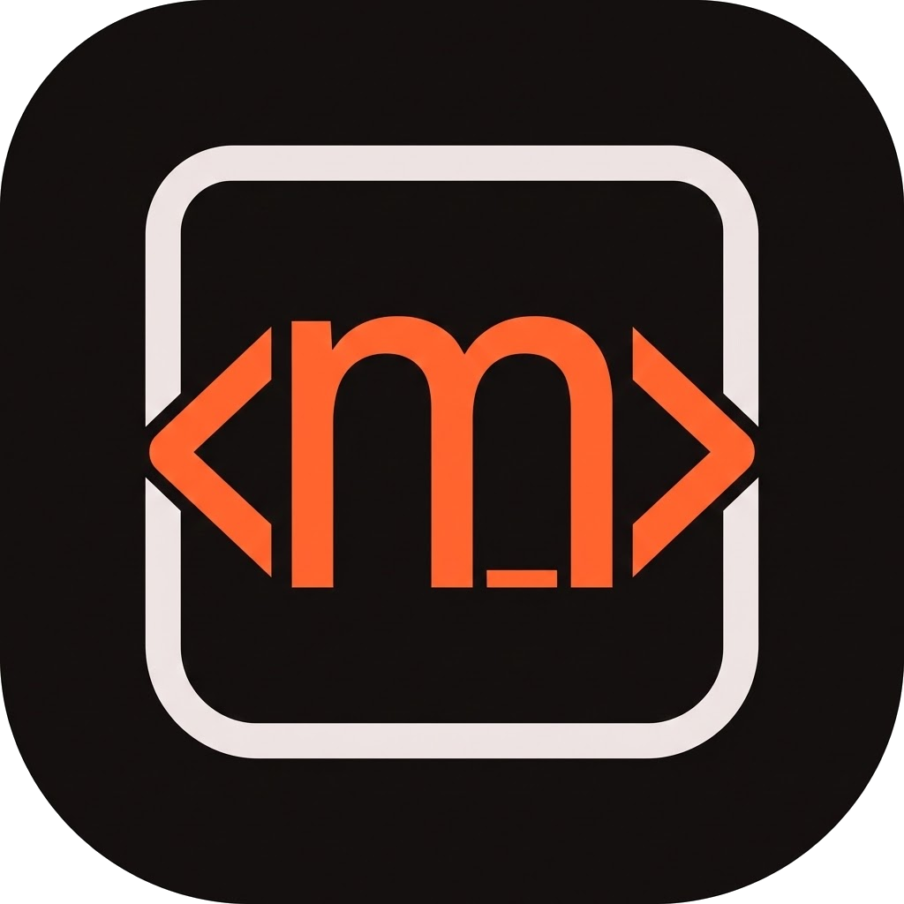

# moCODE

moCODE is a modern, developer-first Flutter client for a local/remote AI coding server. It provides a powerful interface for interacting with AI models to generate code, plan features, and manage your development workflow.



## Features

### 🚀 Smart Session Management
- **Project Intelligence**: Integrated project picker showing VCS status (Git branch/context) and project health indicators.
- **Full Control**: Create, fork, archive, and share chat sessions.
- **Safe Deletion**: Robust session deletion with confirmation dialogs to prevent accidental data loss.
- **Live Status**: Real-time session status indicators, including "Planning" vs "Building" modes and animated busy states.

### 💬 Powerful Chat Interface
- **Context-Aware Input**:
  - **@ File Mentions**: Instantly search and attach files to your context using a custom, high-performance fuzzy search (Dart port of Fuzzysort).
  - **/ Slash Commands**: Quick access to powerful commands and skills.
- **Rich Rendering**: Markdown support with code highlighting, file previews, and responsive layouts.
- **File Integration**: Seamless file uploads and diff viewing with file type icons.

### 🧠 Advanced Model Management
- **Flexible Selection**: Choose models from your configured providers or browse a global registry of all available models.
- **Favorites System**: Star your most-used models to keep them at the top of your list.
- **Smart Persistence**: Remembers your preferred model per session and allows setting a global default.

### 🛠 Developer-Centric Tools
- **Rich Diff Viewer**: Visual file changes with syntax highlighting and clear additions/deletions.
- **Error Handling**: User-friendly error messages with parsed API feedback and connection troubleshooting.
- **Customizable**: Settings for server configuration, host/port management, and UI preferences.

## Tech Stack

- **Framework**: [Flutter](https://flutter.dev) + [Riverpod](https://riverpod.dev) (State Management)
- **Navigation**: [GoRouter](https://pub.dev/packages/go_router)
- **Networking**: [Dio](https://pub.dev/packages/dio) for REST + WebSocket/SSE for real-time streams
- **UI/UX**: Custom design system with [Google Fonts](https://fonts.google.com), [Shimmer](https://pub.dev/packages/shimmer) effects, and [Simple Icons](https://simpleicons.org).
- **Core Utilities**:
  - Custom `Fuzzysort` implementation for Dart.
  - Markdown rendering with code block support.

## Getting Started

1.  **Prerequisites**: Ensure you have the Flutter SDK installed on your machine.
2.  **Clone**:
    ```bash
    git clone https://github.com/vkpdeveloper/moCODE.git
    cd moCODE
    ```
3.  **Install Dependencies**:
    ```bash
    flutter pub get
    ```
4.  **Codegen**:
    This project uses code generation for Riverpod and JSON serialization.
    ```bash
    dart run build_runner build -d
    ```
5.  **Run**:
    ```bash
    flutter run
    ```
